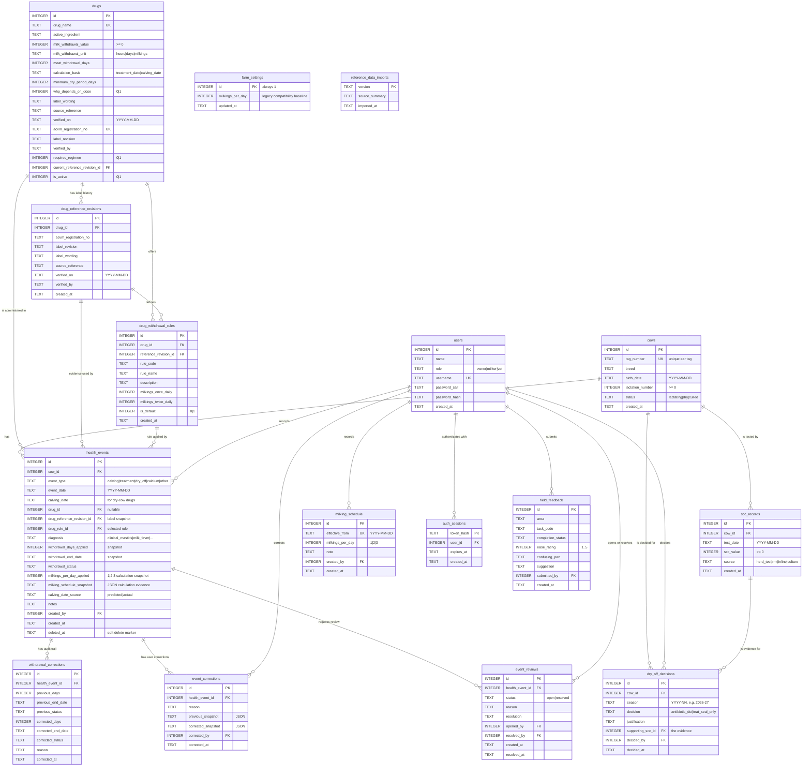

# CalvingLog — Database Design

Schema version **8** · SQLite

This document describes the finished database layer: the entity relationships, the
constraints that enforce them, and the reasoning behind the design decisions that are
not obvious from the table definitions alone.

To confirm that everything described here is actually enforced by the live database
rather than merely written in the schema file:

```
npm run verify-db
```

Version 8 adds `field_feedback`. The page, test task, completion result and 1–5 ease score
use controlled values; optional comments are capped at 1,000 characters. `submitted_by` is
taken from the authenticated session and enforced as a foreign key, so the browser cannot
claim that another role supplied the response. Only the Owner API can list responses.

---

## 1. Entity relationships



`health_events` is the centre of the operational schema. `drugs` identifies a product;
`drug_reference_revisions` records the exact Approved Label evidence used at a point in
time; and `drug_withdrawal_rules` records the labelled milking counts for selectable
regimens. The v4 value/unit fields remain on `drugs` as the current/default calculation
profile for products that do not require a regimen.
Every new medicated event using an active product points to the revision it used; an event
for a product with named regimens also points to its selected rule. A legacy event whose
product has no verified current revision is left unresolved and visible for review.
Changing the current label therefore does not detach a historical result from its
evidence. `milking_schedule` records when the farm moves between once-, twice- and
three-times-daily milking. `farm_settings` remains as a compatibility baseline for older
clients, but it is not the history used by new calculations.
`withdrawal_corrections` records before/after snapshots when reference-data corrections
are intentionally backfilled, while `reference_data_imports` makes each official data
package idempotent and auditable.
`event_corrections` separately records user-initiated changes with the signed-in actor,
reason, and complete before/after JSON. `event_reviews` gives every automatically
unprovable result an accountable lifecycle: at most one open review per event, and a
resolved review must have a resolution, actor and timestamp. `auth_sessions` stores only
a hash of the browser token; the raw token exists only in an HttpOnly cookie.

---

## 2. Design decisions

### 2.1 Product, label revision and rule are different records

A product name is not enough evidence for a withholding calculation. One product can
receive a new Approved Label, and one label can contain several rules for different
regimens or conditions. Schema v5 introduced the separation of three concepts:

| Record | Meaning | Lifecycle |
|---|---|---|
| `drugs` | the product identity, ACVM registration and current/default calculation profile | stable catalogue entry |
| `drug_reference_revisions` | the exact Approved Label, source and verification sign-off | immutable evidence for a label revision |
| `drug_withdrawal_rules` | the labelled milking counts for a regimen | zero or more per revision; required for regimen products |

`drugs.current_reference_revision_id` says which verified revision new events should use.
Verified historical events retain `drug_reference_revision_id` and, when applicable,
`drug_rule_id`; a later label update cannot silently attach old treatment records to new
evidence.

### 2.1a Labels use different units and starting points

"A number of days after treatment" is not a general model for milk withholding. The
verified labels in the reference set use hours, milkings and conditional periods.

| Structure | Example | Modelled as |
|---|---|---|
| Hours after the last treatment | Penethaject | `milk_withdrawal_unit = 'hours'`, rounded up for a date-only result |
| Milkings after the last treatment | Mastalone and Orbenin L.A. regimen rules | counted against `milking_schedule` from the treatment date |
| Milkings after calving | Cepravin Dry Cow and Teatseal | `calculation_basis = 'calving_date'` plus a milkings rule |
| Conditional early-calving instruction | Cepravin Dry Cow | calculator branch using the verified profile, treatment date and predicted/actual calving date |

Milkings are not days. Eight milkings is four days while the herd remains twice daily and
eight days while it remains once daily. If the frequency changes part way through an
interval, the calculator counts the milkings available under each dated schedule entry;
it does not divide by whichever value happens to be current today. The product profile
stores the general label unit and regimen rules store their once-/twice-daily labelled
counts. The event stores the resulting frequency and schedule evidence.

### 2.1b Regimens must be selected, not inferred

The current Orbenin L.A. Approved Label groups the 3 × 48-hour and 5 × 48-hour courses
under one withholding instruction and gives the 5 × 24-hour course another, with
different milking counts for once- and twice-daily milking. `drugs.requires_regimen` makes
that distinction visible to the API and front end. A treatment event for such a product
must provide `drug_rule_id`; the server verifies that the rule belongs to the product's
current revision.

Those rules provide counts for once- and twice-daily milking only. If the farm is set to
three milkings per day, the calculator returns no automatic Orbenin clear date and flags
the event for review rather than extrapolating beyond the label.

This avoids a dangerous default: choosing a convenient rule merely because the product
name matches. For course-based rules, `event_date` is the date of the last treatment (the
point from which the label says to count).

Legacy v4 events have no regimen field. The v5 import associates the default Orbenin rule
only when **every** approved regimen resolves to the same date at the farm's current
milking frequency, and records that equivalence in `withdrawal_corrections.reason`. If the
possible results differ, the importer leaves `drug_rule_id` unresolved and sets the event
to require attention; it does not guess which course was used.

### 2.1c Predicted calving dates are not facts

A calving date entered at dry-off is a prediction. `calving_date_source` distinguishes
`predicted` from `actual`, and recording a calving event reconciles open dry-cow events
against the real date.

Cepravin Dry Cow illustrates why this matters. If calving is at least 49 days after
treatment, the rule is eight milkings after calving. If calving occurs within 49 days,
the label requires the full 49 days from treatment and a further eight milkings. At date
resolution the early-calving result is therefore treatment date + 49 days + the converted
eight milkings. The calculator applies that branch instead of removing the clear date and
replacing the label with a generic warning.

Teatseal also counts from calving: milk is withheld for eight milkings (approximately
96 hours on the labelled routine), while the meat withholding period is nil. It must not
be represented as zero days from the dry-off treatment date.

When a required date or rule is genuinely unavailable, the system stores no clear date
and exposes the reason through `withdrawal_status` and `requires_attention`. An unknown
answer remains on the vat-exclusion list; it is never treated as safe.

### 2.1d Milking frequency changes through the season

`milking_schedule.effective_from` makes each once-, twice- or three-times-daily change
explicit. There is at most one entry for a date. Treatment-date products resolve the
schedule at the treatment date; dry-cow products resolve it at the calving date. The
calculator then walks forward across any later schedule changes until the labelled number
of milkings has elapsed.

An event may carry an explicit frequency override when the mob or cow did not follow the
farm schedule. In that case the override is used as a constant for that event and the JSON
snapshot records `event_override` as its source. Otherwise the snapshot contains the dated
farm schedule used by the calculation. This preserves the operational explanation even if
future schedule entries are later added.

### 2.2 The withholding result is a snapshot, not a calculation

`withdrawal_days_applied`, `withdrawal_end_date` and `withdrawal_status` are stored on the
event. A milking-based result also stores `milkings_per_day_applied` and
`milking_schedule_snapshot`. A calculable active-product event stores the revision identifier
and, when applicable, the selected rule identifier from which those values came.

Calculating them at query time would mean that any future revision to a drug's
registered withholding period would silently rewrite history. If MPI revises a drug from
four days to five in 2027, a treatment given in 2026 would retrospectively display a
different clear date — even though the cow was legitimately milked on the original date
under the rule that applied at the time.

The column is named `..._applied` rather than `..._days` deliberately: it records the
date-level number of days applied to *this* event, while the linked rule retains the
original label unit and conditions.

There are two deliberate recalculation paths. An actual calving event replaces a
prediction for an open dry-cow event while retaining its applicable regimen rule.
`PUT /api/events/:id` is an explicit correction: it revalidates the selected product/rule
against the current active revision and updates the event's reference link as well as its
result. What is protected from passive change is history that has not been corrected;
mistaken inputs and superseded predictions are not frozen.

### 2.3 Treatment records are never physically deleted

`DELETE /api/events/:id` sets `deleted_at` and nothing else. Treatment records are food
safety records; an audit that can be made to disappear is not an audit.

The update statement carries `AND deleted_at IS NULL`, so deleting an already-deleted
record correctly returns 404 rather than silently succeeding.

### 2.4 One dry-off decision per cow per season

`UNIQUE (cow_id, season)`.

From 1 January 2027, VCNZ requires an individualised justification for every cow given
dry-cow antibiotics. If a cow could carry two contradictory decisions for the same
season, the table could not serve as evidence of anything. The constraint makes the
contradiction impossible to store rather than merely discouraged.

### 2.5 Diagnosis is a controlled field, not free text

One of the criteria for antibiotic dry-cow therapy is a history of clinical mastitis
during the lactation. Before structured diagnosis was added, the only way to find that
history was to search `notes` for the word "mastitis" — which depends on whoever was on
shift writing `mastitis`, `Mastitis`, `mast LF`, or nothing at all.

Compliance evidence cannot rest on string matching, so `diagnosis` was added as a
constrained enum. It is nullable, because existing records cannot be retrospectively
diagnosed and "not recorded" is genuinely different from "no disease".

### 2.6 Dates must be real dates

Every domain date stored in `YYYY-MM-DD` form carries
`CHECK (col IS strftime('%Y-%m-%d', col))`.

`strftime` returns NULL for anything it cannot parse, and `IS` (rather than `=`) treats
that NULL as a failed comparison. The same expression rejects three separate classes of
bad data in one line:

| Rejected | Reason |
|---|---|
| `'yesterday'` | not parseable as a date |
| `'2026-8-1'` | parseable but not canonical, would break string comparison in date-range queries |
| `'2026-02-31'` | SQLite would silently normalise this to 2026-03-03 |
| `'10/08/2026'` | ambiguous day/month order |

The canonical-format requirement matters because the daily vat-exclusion query compares
dates as strings. `'2026-8-1' >= '2026-08-10'` is true as a string comparison and false
as a date — a cow would be dropped from the exclusion list while still inside her
withholding period.

### 2.7 Nothing derivable is stored

The daily vat-exclusion list is a query, not a table. It is derived from the event
snapshots every time it is requested, so it cannot drift out of step with the records it
summarises.

### 2.8 Identity and corrections are server-controlled

The UI does not submit `created_by`, `decided_by` or `corrected_by`. The authenticated session
supplies the actor after the raw cookie token has been hashed and matched to an unexpired
`auth_sessions` row. Passwords are stored as salted scrypt hashes, never as plaintext.

Role checks protect the actions with the greatest safety or audit impact: owner-only farm
settings and account creation; owner/vet medicine verification, historical corrections,
review resolution and final dry-off decisions. A milker may still record a new operational
event, which is necessary during a shift, but cannot silently rewrite its history.

An event correction requires a meaningful reason. The database validates both JSON snapshots
and retains the original event creator. If the corrected event is still unprovable, its open
review is updated; if the correction supplies the missing authoritative fact, the review is
resolved with the signed-in actor while remaining available in review history.

---

## 3. Indexes

| Index | Column(s) | Purpose |
|---|---|---|
| `idx_health_events_cow` | `cow_id` | joins, and FK checks when deleting a cow |
| `idx_health_events_drug` | `drug_id` | joins to the drug reference table |
| `idx_health_events_created_by` | `created_by` | audit lookups by staff member |
| `idx_health_events_withdrawal` | `withdrawal_end_date` *(partial)* | the daily vat-exclusion query |
| `idx_health_events_diagnosis` | `cow_id, diagnosis` *(partial)* | mastitis history for dry-off decisions |
| `idx_health_events_pending_calving` | `cow_id` *(partial)* | dry-cow events awaiting reconciliation with actual calving |
| `idx_health_events_reference_revision` | `drug_reference_revision_id` | trace an event to its Approved Label evidence |
| `idx_health_events_drug_rule` | `drug_rule_id` | trace an event to its selected regimen rule |
| `idx_drugs_acvm_registration` | `acvm_registration_no` *(unique, partial)* | prevent two products claiming the same populated registration |
| `idx_drugs_current_reference_revision` | `current_reference_revision_id` | resolve the evidence used for new events and cover the foreign key |
| `idx_drug_reference_revisions_drug` | `drug_id` | a product's label history |
| `idx_drug_withdrawal_rules_drug` | `drug_id` | regimen lookup for treatment entry |
| `idx_drug_withdrawal_rules_revision` | `reference_revision_id` | rules derived from one label revision |
| `idx_drug_withdrawal_rules_default` | `drug_id` *(unique, partial)* | at most one default rule per product |
| `idx_withdrawal_corrections_event` | `health_event_id` | correction history for one event |
| `idx_scc_records_cow` | `cow_id` | a cow's test history |
| `idx_decisions_cow` | `cow_id` | a cow's decision history |
| `idx_decisions_scc` | `supporting_scc_id` | tracing a decision back to its evidence |
| `idx_decisions_decided_by` | `decided_by` | audit lookups |
| `idx_milking_schedule_created_by` | `created_by` | audit who recorded a seasonal frequency change |
| `idx_auth_sessions_user` | `user_id` | revoke and inspect sessions for one user |
| `idx_auth_sessions_expiry` | `expires_at` | remove expired sessions efficiently |
| `idx_event_corrections_event` | `health_event_id` | correction history for one event |
| `idx_event_corrections_user` | `corrected_by` | corrections by accountable actor |
| `idx_event_reviews_open` | `health_event_id` *(unique, partial)* | at most one open review per event |
| `idx_event_reviews_opened_by` | `opened_by` | review-opening accountability |
| `idx_event_reviews_resolved_by` | `resolved_by` | review-resolution accountability |

The event-list partial indexes carry predicates that exclude deleted or irrelevant rows,
so those rows are removed from the index itself rather than filtered after reading. The
daily vat-exclusion query is the one the system runs most often and the one that matters
most, and it resolves through `idx_health_events_withdrawal` instead of scanning the
table. The partial unique indexes express separate invariants: populated ACVM
registrations are unique, and a product has at most one default rule.

SQLite does not create indexes on foreign key columns automatically. Without them, every
join is a full scan and every parent-row deletion scans the child tables to check the
constraint.

---

## 4. Migrations

SQLite cannot add a constraint to an existing table. Changing one means rebuilding it:
create the new table, copy the rows, drop the old one, rename. `migrate.js` holds each
structural change as a numbered migration and records progress in `PRAGMA user_version`,
so an existing database upgrades in place instead of being deleted and rebuilt.

| Version | Change |
|---|---|
| 1 | initial core schema |
| 2 | value constraints (non-negative numbers, canonical dates, one decision per cow per season, unique SCC test) and indexes on all foreign keys |
| 3 | structured `diagnosis` column on health events |
| 4 | withholding periods modelled as value + unit, minimum dry period, dose-dependence flag, provenance fields, `farm_settings`, and predicted/actual calving dates |
| 5 | ACVM registration metadata, versioned label evidence and regimen rules, event-to-rule links, provenance triggers, correction audit records, and idempotent reference-data import records |
| 6 | effective-dated milking schedule plus event-level frequency and schedule snapshots for reproducible seasonal calculations |
| 7 | salted user credentials, server-side sessions, role authorisation, user correction snapshots and accountable event reviews |

Databases created before migrations were introduced carry `user_version = 0` but already
hold the version 1 schema. `currentVersion()` detects this by checking whether
`health_events` exists, so those databases resume at the right point instead of trying to
re-create tables that are already there.

Each migration runs inside a transaction, with `foreign_keys` and `legacy_alter_table`
set around it as the SQLite documentation requires for the table-rebuild procedure, and
`foreign_key_check` runs afterwards to confirm nothing was orphaned.

After migration, `db.js` runs the separately versioned ACVM reference import. On the first
v5 import into an existing default database it creates
`calving-log.db.backup-before-acvm-v5-20260817`, then updates the product catalogue,
creates immutable revision/rule records, and reviews active historical events in one
transaction. Each reviewed event gets a `withdrawal_corrections` before/after record;
soft-deleted events are left unchanged. A legacy regimen is inferred only in the
date-equivalent case described above. `reference_data_imports.version` prevents the same
package from being applied twice.

---

## 5. Reference data status

> **All five active reference products have current ACVM label evidence.**

The initial v5 reference import was checked on 2026-08-17 against the MPI ACVM register
and the current Approved Label attached to the matching registration.

| Product | ACVM registration | Approved Label revision | Status |
|---|---|---|---|
| Orbenin L.A. | A003664 | June 2026 | active; verified; regimen selection required |
| Mastalone | A000829 | May 2022 | active; verified |
| Penethaject | A009423 | October 2025 | active; verified |
| Cepravin Dry Cow | A003322 | July 2025 | active; verified; normal and early-calving logic represented |
| Teatseal | A007294 | October 2025 | active; verified; eight milkings after calving, meat nil |
| Bovaclox DC Xtra | A009020 | no current Approved Label available | inactive; must not be used for calculation |

A004495 is the registration for **Bovaclox Dry Cow**, not Bovaclox DC Xtra. Its Approved
Label is not evidence for A009020 and must never be substituted merely because the trade
names are similar.

Verification is evidence, not a boolean added to a number. A usable current revision
records the matching registration, revision, label wording, official source,
`verified_on`, and `verified_by`. Where a label has regimen-specific variants, its rules
are derived from that same revision. `drugs.current_reference_revision_id` points new
treatments at it. `GET /api/drugs/reference-status` and `GET /api/drugs/unverified` make
gaps visible, and `npm run verify-db` treats an unverified active product as a failed
safety check.

When MPI publishes a changed label, add a new `drug_reference_revisions` row and its rules,
then move the product's current pointer. Do not overwrite the revision linked to historical
events. If the matching registration or current Approved Label cannot be established,
deactivate the product until it can be verified.
