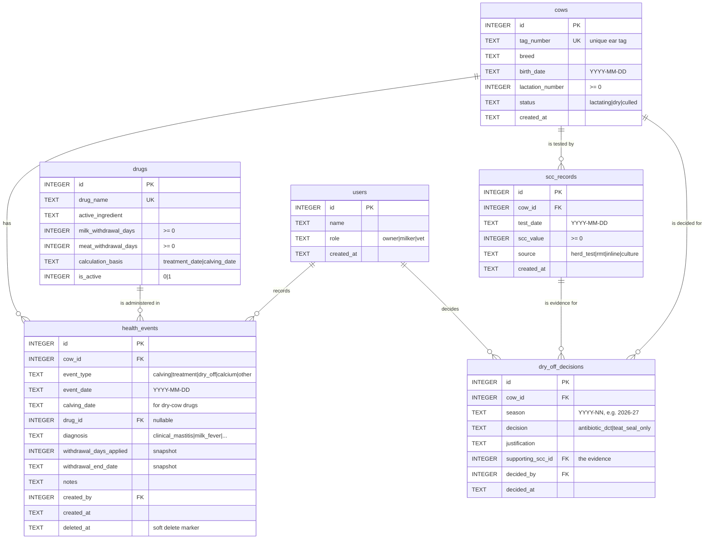

# CalvingLog — Database Design

Schema version **3** · six tables · SQLite

This document describes the finished database layer: the entity relationships, the
constraints that enforce them, and the reasoning behind the design decisions that are
not obvious from the table definitions alone.

To confirm that everything described here is actually enforced by the live database
rather than merely written in the schema file:

```
npm run verify-db
```

---

## 1. Entity relationships



`health_events` is the centre of the schema. Everything else is either a thing an event
refers to (`cows`, `drugs`, `users`) or a separate record with its own lifecycle
(`scc_records`, `dry_off_decisions`).

---

## 2. Design decisions

### 2.1 Two withholding calculation bases

The single most important rule in the system, and the one a general-purpose
implementation is most likely to get wrong.

| Drug type | Counted from | Why |
|---|---|---|
| Lactating-cow treatment | the treatment date | the cow is milking, so the clock starts immediately |
| Dry-cow therapy | the **next calving date** | the cow is not milking at the time of treatment, so the clock cannot start until she calves and comes back into milk |

This is why `drugs.calculation_basis` exists. If every drug were counted from the
treatment date, dry-cow treatments would clear months too early and contaminated milk
would reach the vat while the system reported the cow as safe.

When a dry-cow drug is recorded but the calving date is not yet known, the system stores
**no withholding end date at all** rather than guessing. In a food safety context,
"unknown" is a safe answer and a wrong date is not.

### 2.1a How labels actually express the period

Checking the drug reference data against the ACVM register and manufacturer labels showed
that "a number of days" is not how withholding periods are written. Three different
structures appear, and the schema has to hold all of them.

| Structure | Example | Modelled as |
|---|---|---|
| Hours | Orbenin L.A., 96 hours | `milk_withdrawal_unit = 'hours'`, rounded up to whole days |
| Milkings after calving | Cepravin Dry Cow, 8 milkings | `milk_withdrawal_unit = 'milkings'`, converted using `farm_settings.milkings_per_day` |
| Minimum dry period | Cepravin Dry Cow, at least 49 days before calving | `minimum_dry_period_days`, a precondition rather than a duration |
| Dependent on dose | procaine penicillins | `whp_depends_on_dose`, which suppresses automatic calculation |

Two consequences are worth stating plainly.

**Milkings are not days.** Eight milkings is four days on a twice-a-day farm and eight
days on a once-a-day farm. Storing the converted number alone would silently encode one
farm's milking routine into what looks like a property of the drug.

**A minimum dry period is a condition, not a countdown.** Cepravin's label reads
*"Treatment to be at least 49 days before calving."* If a cow calves sooner than that, the
condition under which the withholding period was established has not been met, so the
usual period no longer applies. The system responds by withdrawing the clear date
entirely and flagging the cow for veterinary advice — it does not calculate a longer
period, because it has no basis on which to choose one.

**Dose-dependent periods are not modelled.** A 2023 Veterinary Council notice records that
label dose rates for many procaine penicillins were below therapeutic levels and have been
revised upward, and that higher doses require longer withholding periods; MPI published a
table covering 69 products. Reproducing that table is outside the scope of this project,
and a partial reproduction would be worse than none. Such drugs are flagged instead, and
the system requires the period to be entered by hand rather than deriving one.

### 2.1b Predicted calving dates are not facts

A calving date entered at dry-off is a prediction. The original design stored it and
calculated a clear date from it with no record that the input was an estimate, so a cow
calving early left a stale clear date in place that still looked authoritative.

`calving_date_source` now distinguishes `predicted` from `actual`. Recording a calving
event reconciles any open dry-cow withholding period for that cow against the real date.

The snapshot rule is unchanged and the distinction matters: what is frozen at write time
is the **rule** that applied — the number of days — not the **inputs** it was given. A
prediction becoming a fact is an input changing, so the end date is recalculated while
`withdrawal_days_applied` stays as it was.

### 2.2 The withholding result is a snapshot, not a calculation

`withdrawal_days_applied` and `withdrawal_end_date` are computed once, at entry, and
stored on the event.

Calculating them at query time would mean that any future revision to a drug's
registered withholding period would silently rewrite history. If MPI revises a drug from
four days to five in 2027, a treatment given in 2026 would retrospectively display a
different clear date — even though the cow was legitimately milked on the original date
under the rule that applied at the time.

The column is named `..._applied` rather than `..._days` deliberately: it records the
number of days that were applied to *this* event, not the number of days the drug
currently carries.

The one case where the snapshot is deliberately recomputed is `PUT /api/events/:id`. A
correction means the original entry was wrong, so the stored result should change. What
is frozen is history, not mistakes.

### 2.3 Treatment records are never physically deleted

`DELETE /api/events/:id` sets `deleted_at` and nothing else. Treatment records are food
safety records; an audit that can be made to disappear is not an audit.

The update statement carries `AND deleted_at IS NULL`, so deleting an already-deleted
record correctly returns 404 rather than silently succeeding.

### 2.4 One dry-off decision per cow per season

`UNIQUE (cow_id, season)`.

From 1 January 2027, VCNZ requires an individualised justification for every cow given
dry-cow antibiotics. If a cow could carry two contradictory decisions for the same
season, the table could not serve as evidence of anything. The constraint makes the
contradiction impossible to store rather than merely discouraged.

### 2.5 Diagnosis is a controlled field, not free text

One of the criteria for antibiotic dry-cow therapy is a history of clinical mastitis
during the lactation. Before schema version 3, the only way to find that history was to
search `notes` for the word "mastitis" — which depends on whoever was on shift writing
`mastitis`, `Mastitis`, `mast LF`, or nothing at all.

Compliance evidence cannot rest on string matching, so `diagnosis` was added as a
constrained enum. It is nullable, because existing records cannot be retrospectively
diagnosed and "not recorded" is genuinely different from "no disease".

### 2.6 Dates must be real dates

Every date column carries `CHECK (col IS strftime('%Y-%m-%d', col))`.

`strftime` returns NULL for anything it cannot parse, and `IS` (rather than `=`) treats
that NULL as a failed comparison. The same expression rejects three separate classes of
bad data in one line:

| Rejected | Reason |
|---|---|
| `'yesterday'` | not parseable as a date |
| `'2026-8-1'` | parseable but not canonical, would break string comparison in date-range queries |
| `'2026-02-31'` | SQLite would silently normalise this to 2026-03-03 |
| `'10/08/2026'` | ambiguous day/month order |

The canonical-format requirement matters because the daily vat-exclusion query compares
dates as strings. `'2026-8-1' >= '2026-08-10'` is true as a string comparison and false
as a date — a cow would be dropped from the exclusion list while still inside her
withholding period.

### 2.7 Nothing derivable is stored

The daily vat-exclusion list is a query, not a table. It is derived from the event
snapshots every time it is requested, so it cannot drift out of step with the records it
summarises.

---

## 3. Indexes

| Index | Column(s) | Purpose |
|---|---|---|
| `idx_health_events_cow` | `cow_id` | joins, and FK checks when deleting a cow |
| `idx_health_events_drug` | `drug_id` | joins to the drug reference table |
| `idx_health_events_created_by` | `created_by` | audit lookups by staff member |
| `idx_health_events_withdrawal` | `withdrawal_end_date` *(partial)* | the daily vat-exclusion query |
| `idx_health_events_diagnosis` | `cow_id, diagnosis` *(partial)* | mastitis history for dry-off decisions |
| `idx_scc_records_cow` | `cow_id` | a cow's test history |
| `idx_decisions_cow` | `cow_id` | a cow's decision history |
| `idx_decisions_scc` | `supporting_scc_id` | tracing a decision back to its evidence |
| `idx_decisions_decided_by` | `decided_by` | audit lookups |

The two partial indexes carry `WHERE deleted_at IS NULL`, so soft-deleted rows are
excluded from the index itself rather than filtered out after reading. The daily
vat-exclusion query is the one the system runs most often and the one that matters most,
and it now resolves through `idx_health_events_withdrawal` instead of scanning the table.

SQLite does not create indexes on foreign key columns automatically. Without them, every
join is a full scan and every parent-row deletion scans the child tables to check the
constraint.

---

## 4. Migrations

SQLite cannot add a constraint to an existing table. Changing one means rebuilding it:
create the new table, copy the rows, drop the old one, rename. `migrate.js` holds each
structural change as a numbered migration and records progress in `PRAGMA user_version`,
so an existing database upgrades in place instead of being deleted and rebuilt.

| Version | Change |
|---|---|
| 1 | initial six-table schema |
| 2 | value constraints (non-negative numbers, canonical dates, one decision per cow per season, unique SCC test) and indexes on all foreign keys |
| 3 | structured `diagnosis` column on health events |
| 4 | withholding periods modelled as value + unit, minimum dry period, dose-dependence flag, provenance fields, `farm_settings`, and predicted/actual calving dates |

Databases created before migrations were introduced carry `user_version = 0` but already
hold the version 1 schema. `currentVersion()` detects this by checking whether
`health_events` exists, so those databases resume at the right point instead of trying to
re-create tables that are already there.

Each migration runs inside a transaction, with `foreign_keys` and `legacy_alter_table`
set around it as the SQLite documentation requires for the table-rebuild procedure, and
`foreign_key_check` runs afterwards to confirm nothing was orphaned.

---

## 5. Reference data status

> **The withholding periods in the drug table are not yet verified.**

The schema now records provenance alongside each figure:

| Column | Purpose |
|---|---|
| `label_wording` | the exact text from the product label |
| `source_reference` | where it was read — register entry or manufacturer page |
| `verified_on` | the date it was checked; `NULL` means unverified |

`verified_on IS NULL` is the definition of unverified, and the system surfaces it rather
than hiding it: `GET /api/drugs/unverified` lists what is outstanding, the daily
vat-exclusion list carries a warning for any cow whose figure has not been checked, and
`npm run verify-db` prints the status of every drug.

`PUT /api/drugs/:id` refuses to set `verified_on` unless both `label_wording` and
`source_reference` are supplied. Marking something as verified without recording what was
read is not verification.

A wrong withholding figure does not produce a slightly-off answer; it produces a
confident, plausible answer that puts contaminated milk in the vat. The schema can now
express what the labels actually say, but the figures themselves still have to be read off
the register and entered.

This remains the outstanding blocker for the project.
